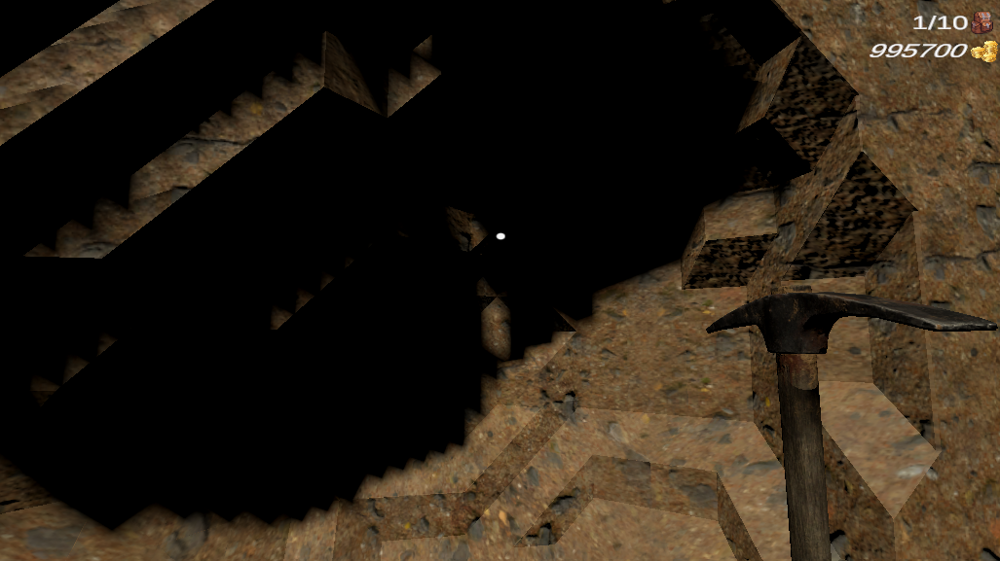
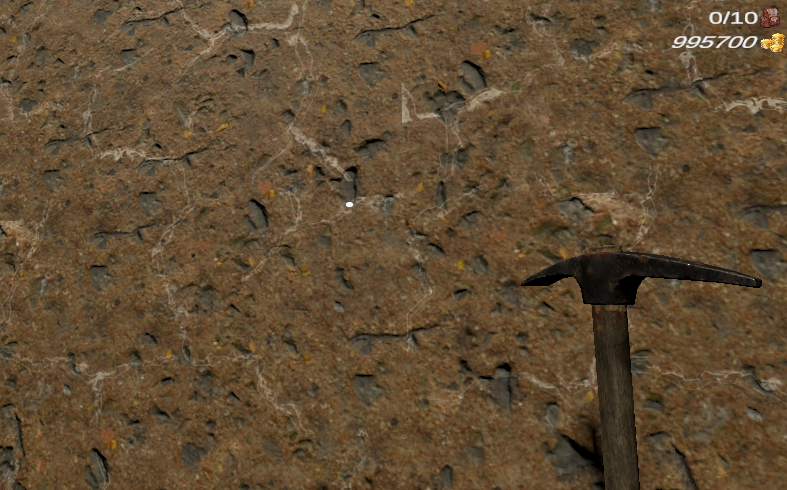
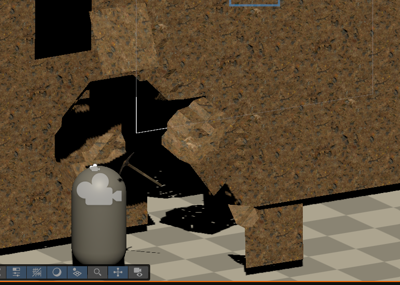
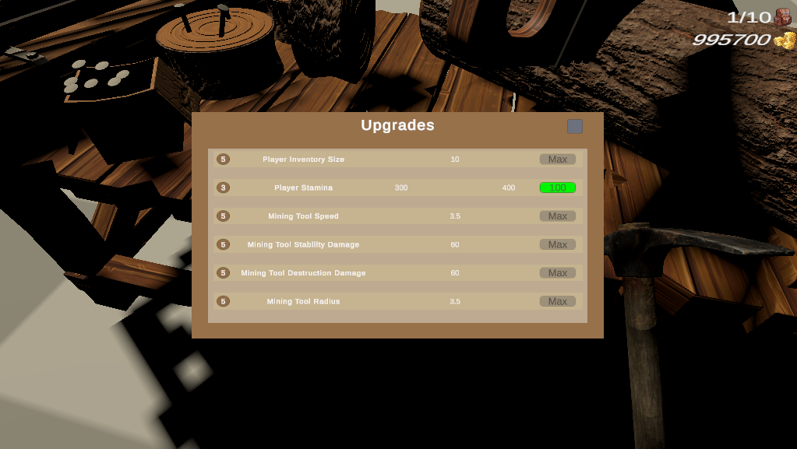
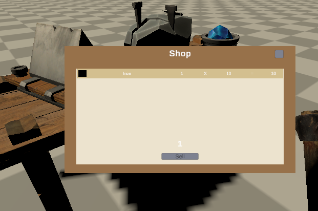
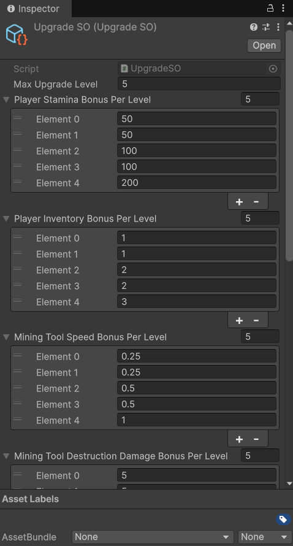

# TwinEdgeMiner

A solo-developed Unity technical prototype focused on experimental mining mechanics, runtime terrain deformation, and custom mesh generation.

## Overview

**TwinEdgeMiner** is an in-development Unity mining prototype built around a custom two-sided pickaxe mechanic, deformable terrain, ore-specific destruction logic, and runtime mesh generation.

The project is not presented as a finished commercial game.  
Instead, it is a technical prototype focused on exploring how mining, terrain damage, ore behavior, progression, inventory, UI, and mesh deformation can work together in a custom Unity gameplay system.

The main goal of the project was to move beyond simple block-based digging and create a mining system where the terrain has different internal states, visible damage feedback, and gameplay logic driven by the type of material being mined.

---

## Core Idea

The main gameplay idea is a **two-sided pickaxe**.

Each side of the pickaxe has a different purpose:

- One side is focused on damaging the internal structure of the ground.
- The other side is focused on removing material and collecting resources.

This creates two different terrain states:

- **Stability** — represents how structurally weakened the ground is.
- **Durability** — represents how much material remains before the terrain or ore is removed.

A simple example:

- Hitting with one side is like trying to **crack a stone**.
- Hitting with the other side is like **loosening and removing soil or ore material**.

This mechanic was designed to make mining feel more intentional than repeatedly clicking the same spot until it disappears.

---

## Two-Sided Pickaxe System

The pickaxe can attack from two sides, and each side affects the terrain differently.

### Stability Damage

One side of the pickaxe deals more damage to the ground structure.

This reduces the terrain's **stability** and visually weakens the surface before it is fully destroyed.

### Durability Damage

The other side removes more terrain volume and is more focused on extracting material.

This affects the terrain's **durability** and is used more directly for resource collection.

### Animation and State Handling

The pickaxe has transition animations between its two states.

To avoid gameplay and animation issues, the system uses a **state machine**.  
This helps prevent problems where the player tries to change actions in the middle of an animation or while the pickaxe is transitioning between attack modes.

---

## Ore System

Ores are not only simple collectible objects.

In this prototype, ores affect the surrounding terrain mesh and change how nearby ground behaves.

When ore is present, the terrain logic around it changes from regular ground behavior to ore-specific behavior.

This affects:

- how stability is reduced;
- how durability is reduced;
- how the terrain is destroyed;
- how resources are collected.

Ore destruction is also different from regular terrain destruction.

Instead of being removed like normal ground, ore uses a more specific destruction shape based on:

- the center of the ore;
- the area affected by the pickaxe hit;
- a cone-like removal pattern.

This was designed to make ore mining feel different from normal digging and to give each resource area its own behavior.

---

## Visual Damage Feedback

When terrain stability changes, cracks appear on the ground surface.

This gives the player visual feedback about mining progress before the terrain is fully destroyed.

The current crack visualization is implemented with a custom **Shader Graph** setup.

The shader is currently functional, but it is still a work in progress.  
I am also working on an HLSL-based version to have more control over the final visual result and to improve some limitations of the current Shader Graph implementation.

---

## Runtime Terrain and Mesh Generation

The terrain mesh was implemented manually using the **Marching Cubes** algorithm.

This was necessary because the gameplay mechanics require runtime terrain modification, smooth terrain shapes, stability/durability data, ore interaction, and visual damage feedback.

A regular Unity Terrain workflow or simple block-based voxel system would not provide the same type of mining behavior that this prototype needed.

The mesh system supports:

- runtime terrain deformation;
- mining-based mesh updates;
- terrain data modification;
- ore-influenced terrain behavior;
- mesh rebuilding after damage;
- collider updates for modified terrain.

---

## Chunk-Based Optimization

The first version of the terrain system was too heavy for runtime updates.

To improve performance, the terrain was redesigned into a **chunk-based system**.

Instead of rebuilding the entire terrain mesh after every mining action, the project updates only the affected chunk areas.

The mesh generation pipeline was also moved toward a more performance-oriented structure using:

- Unity Job System;
- Burst-compatible code;
- NativeArray-based data;
- chunk-local terrain data;
- runtime mesh buffer updates.

This helped reduce freezes and made runtime digging much more practical.

---

## Implemented Gameplay Systems

The project already includes several gameplay systems beyond the terrain deformation prototype.

### Player

- Basic player movement
- Jumping
- Interaction with mining targets

### Pickaxe

- Two-sided pickaxe logic
- Different behavior for each pickaxe side
- Animation state transitions
- State machine for safer action control

### Terrain

- Runtime mesh deformation
- Stability and durability logic
- Visual crack feedback
- Terrain collider updates
- Chunk-based mesh rebuilding

### Ore

- Ore-specific terrain logic
- Ore-influenced mesh behavior
- Cone-based ore destruction
- Resource collection

### Progression

- Player progression
- Pickaxe upgrades
- Upgrade values configured through ScriptableObjects

### Inventory and Economy

- Item pickup
- Inventory UI
- Selling items from inventory
- Ore pricing setup through ScriptableObjects

### SO

### Saving

- JSON-based save system
- Saved player/progression-related data

### UI

- Inventory interface
- Selling interface
- Upgrade-related UI
- Gameplay-related UI elements

---

## Technical Highlights

- Custom two-sided mining mechanic
- Stability and durability terrain states
- Ore-specific destruction behavior
- Runtime mesh deformation
- Manual Marching Cubes implementation
- Chunk-based terrain system
- Unity Job System usage
- Burst-compatible data flow
- NativeArray-based mesh processing
- Runtime mesh rebuilding
- MeshCollider updates
- Shader Graph crack visualization
- ScriptableObject-based configuration
- JSON save system
- Dependency Injection usage
- Modular gameplay system structure
## Technologies  
  
Unity 6   
C#    
Burst /Jobs  
NativeArray  
ScriptableObjects  
Zenject / Extenject  
Shader Graph  
JSON  
Marching Cubes

---

## Architecture Notes

The project was built with an attempt to keep systems separated and maintainable.

I used Dependency Injection and tried to follow principles such as:

- SOLID
- KISS
- DRY

However, the project is still a prototype, and some parts of the code reflect the learning and experimentation process.

Some systems work well enough for the current prototype, while others are planned for refactoring as the project becomes more stable.

This project was also an important learning step in understanding how to connect gameplay logic, runtime mesh generation, UI, saving, progression, and performance-focused Unity systems inside one project.

---

## Current State

TwinEdgeMiner is currently an in-development technical prototype.

The core systems are implemented and functional, but the project is not finished as a complete game yet.

The current focus is on stabilizing the mining mechanic, improving the terrain and shader pipeline, and preparing the project for a more polished playable version.

---

## Current Limitations

- The mining mechanic is functional but still needs better game feel and balancing.
- Some Marching Cubes edge cases and visual issues still need improvement.
- The crack shader is currently implemented but still needs refinement.
- The current Shader Graph version is planned to be replaced or improved with HLSL.
- Upgrade values and ore prices need proper balancing.
- The world still needs more gameplay content and level design.
- Many visual elements are temporary.
- Some code architecture decisions are planned for future refactoring.
- Audio, particles, props, and global game settings UI are not fully implemented yet.

---

## Planned Improvements

- Improve and refactor crack shaders
- Fix remaining Marching Cubes issues
- Improve mining feedback and game feel
- Balance progression and upgrade numbers
- Prepare the world for actual gameplay
- Add more environmental details and props
- Add sound effects
- Add particle effects
- Improve UI polish
- Add main menu and global settings
- Refactor weaker parts of the codebase
- Improve ore presentation and resource feedback
- Add more complete gameplay goals

---

## Project Background

TwinEdgeMiner was created after an earlier oversized digging prototype.

The previous project helped identify scope and architecture problems.  
TwinEdgeMiner was started with a more focused direction: build the core mining mechanic first, then expand the game around it.

The result is still a prototype, but it has a clearer technical foundation and a more unique gameplay identity.

---

## Status

**In development / technical prototype**

This repository is presented as a portfolio project to show my Unity development process, custom gameplay systems, runtime mesh generation work, and technical problem-solving.